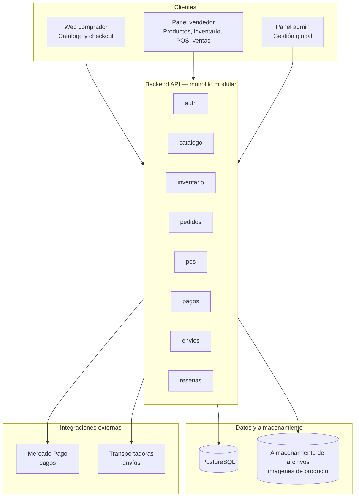

# Arquitectura del Marketplace de Productos Físicos

## Stack de implementación

| Capa | Tecnología |
|---|---|
| API | **FastAPI** (Python) |
| ORM | SQLAlchemy 2.0 |
| Migraciones | **Alembic** |
| Schema Postgres | **`marketplace`** (tablas de dominio + `alembic_version`; no se escribe en `public`) |

El código NestJS/Prisma legado bajo `apps/` y `packages/` no es el stack activo.

## Decisión de arquitectura: monolito modular

Con el volumen esperado (escala media, ~30 peticiones concurrentes, decenas de tiendas), no se justifica una arquitectura de microservicios. Meter microservicios a este tamaño agrega complejidad operativa innecesaria (orquestación, latencia entre servicios, más puntos de falla) sin un beneficio real.

La recomendación es un **monolito modular**: un solo backend desplegable, pero organizado internamente en módulos independientes por dominio de negocio. Esto da orden en el código desde el día uno y, si el negocio crece más adelante, cada módulo se puede separar en un microservicio propio sin rediseñar todo el sistema.

## Diagrama de capas

## Capas del sistema

### 1. Clientes

- **Web de comprador**: catálogo, búsqueda, carrito, checkout
- **Panel del vendedor**: gestión de productos, categorías propias, inventario, precios/promociones, POS (venta rápida), ventas y ganancias
- **Panel de administración**: gestión de usuarios/tiendas, comisiones, moderación

Pueden implementarse como una sola aplicación con vistas según rol, o como aplicaciones separadas — es una decisión de producto/UX, no bloquea la arquitectura backend.

### 2. Backend API (monolito modular)

Expone una API REST consumida por los tres clientes. Internamente dividido en módulos independientes:

| Módulo | Responsabilidad |
|---|---|
| `auth` | Registro, login, roles y permisos |
| `catalogo` | Productos, variantes, categorías/subcategorías propias de cada vendedor |
| `inventario` | Stock por SKU, almacenes, reservas, movimientos |
| `pedidos` | Ciclo de vida del pedido, asignación de almacén de despacho |
| `pos` | Registro de ventas presenciales (venta rápida) |
| `pagos` | Integración con la pasarela de pago (Mercado Pago) |
| `envios` | Cálculo de costos, integración con transportadoras, tracking |
| `resenas` | Calificaciones, reseñas, disputas |

Cada módulo se comunica internamente por funciones/servicios de la propia aplicación (no llamadas de red), lo que evita la complejidad de una arquitectura distribuida manteniendo la separación lógica.

### 3. Datos y almacenamiento

- **PostgreSQL**: base de datos relacional principal. Encaja bien porque el dominio tiene relaciones fuertes (tienda → almacén → stock, pedido → ítems → pago).
- **Almacenamiento de archivos** (tipo S3 o equivalente): imágenes de productos y otros archivos binarios. No se almacenan en la base de datos relacional.

### 4. Integraciones externas

- **Mercado Pago**: procesamiento de pagos vía API + webhooks para confirmar el estado de cada transacción
- **Transportadoras externas**: cotización de envío y tracking de pedidos

## Decisiones clave ligadas a los requerimientos

- **Consistencia de inventario** (evitar sobreventa entre canal online y POS): el control de stock vive centralizado en el módulo `inventario`, con transacciones a nivel de base de datos, de forma que una venta presencial y una compra online no puedan descontar el mismo stock al mismo tiempo.
- **Módulo POS**: reutiliza la misma lógica de descuento de inventario que el checkout online; lo único que cambia es el campo de canal (`presencial` vs `online`).
- **Pagos aislado**: la lógica de pagos queda detrás de una interfaz interna en el módulo `pagos`. Si en el futuro cambian de Mercado Pago a otra pasarela, el cambio se limita a ese módulo sin tocar el resto del sistema.
- **Categorías por vendedor**: al ser manuales y propias de cada tienda, viven como datos dentro del módulo `catalogo`, sin una tabla global de categorías administrada por la plataforma.

## Consideraciones de infraestructura (a este volumen)

- Un solo servidor/instancia (o un clúster pequeño de 2 nodos para alta disponibilidad básica) es suficiente para ~30 peticiones concurrentes
- Contenedores (Docker) para portabilidad y despliegue simple, aunque no es estrictamente necesario a este tamaño
- Backups periódicos de la base de datos
- HTTPS obligatorio, especialmente en checkout, pagos y POS
- Sin necesidad de balanceador de carga complejo ni múltiples réplicas al inicio; se puede escalar verticalmente antes de complicarse con escalado horizontal
# Arquitectura del Marketplace de Productos Físicos

## Decisión de arquitectura: monolito modular

Con el volumen esperado (escala media, ~30 peticiones concurrentes, decenas de tiendas), no se justifica una arquitectura de microservicios. Meter microservicios a este tamaño agrega complejidad operativa innecesaria (orquestación, latencia entre servicios, más puntos de falla) sin un beneficio real.

La recomendación es un **monolito modular**: un solo backend desplegable, pero organizado internamente en módulos independientes por dominio de negocio. Esto da orden en el código desde el día uno y, si el negocio crece más adelante, cada módulo se puede separar en un microservicio propio sin rediseñar todo el sistema.

## Diagrama de capas

## Capas del sistema

### 1. Clientes

- **Web de comprador**: catálogo, búsqueda, carrito, checkout
- **Panel del vendedor**: gestión de productos, categorías propias, inventario, precios/promociones, POS (venta rápida), ventas y ganancias
- **Panel de administración**: gestión de usuarios/tiendas, comisiones, moderación

Pueden implementarse como una sola aplicación con vistas según rol, o como aplicaciones separadas — es una decisión de producto/UX, no bloquea la arquitectura backend.

### 2. Backend API (monolito modular)

Expone una API REST consumida por los tres clientes. Internamente dividido en módulos independientes:

| Módulo | Responsabilidad |
|---|---|
| `auth` | Registro, login, roles y permisos |
| `catalogo` | Productos, variantes, categorías/subcategorías propias de cada vendedor |
| `inventario` | Stock por SKU, almacenes, reservas, movimientos |
| `pedidos` | Ciclo de vida del pedido, asignación de almacén de despacho |
| `pos` | Registro de ventas presenciales (venta rápida) |
| `pagos` | Integración con la pasarela de pago (Mercado Pago) |
| `envios` | Cálculo de costos, integración con transportadoras, tracking |
| `resenas` | Calificaciones, reseñas, disputas |

Cada módulo se comunica internamente por funciones/servicios de la propia aplicación (no llamadas de red), lo que evita la complejidad de una arquitectura distribuida manteniendo la separación lógica.

### 3. Datos y almacenamiento

- **PostgreSQL**: base de datos relacional principal. Encaja bien porque el dominio tiene relaciones fuertes (tienda → almacén → stock, pedido → ítems → pago).
- **Almacenamiento de archivos** (tipo S3 o equivalente): imágenes de productos y otros archivos binarios. No se almacenan en la base de datos relacional.

### 4. Integraciones externas

- **Mercado Pago**: procesamiento de pagos vía API + webhooks para confirmar el estado de cada transacción
- **Transportadoras externas**: cotización de envío y tracking de pedidos

## Decisiones clave ligadas a los requerimientos

- **Consistencia de inventario** (evitar sobreventa entre canal online y POS): el control de stock vive centralizado en el módulo `inventario`, con transacciones a nivel de base de datos, de forma que una venta presencial y una compra online no puedan descontar el mismo stock al mismo tiempo.
- **Módulo POS**: reutiliza la misma lógica de descuento de inventario que el checkout online; lo único que cambia es el campo de canal (`presencial` vs `online`).
- **Pagos aislado**: la lógica de pagos queda detrás de una interfaz interna en el módulo `pagos`. Si en el futuro cambian de Mercado Pago a otra pasarela, el cambio se limita a ese módulo sin tocar el resto del sistema.
- **Categorías por vendedor**: al ser manuales y propias de cada tienda, viven como datos dentro del módulo `catalogo`, sin una tabla global de categorías administrada por la plataforma.

## Consideraciones de infraestructura (a este volumen)

- Un solo servidor/instancia (o un clúster pequeño de 2 nodos para alta disponibilidad básica) es suficiente para ~30 peticiones concurrentes
- Contenedores (Docker) para portabilidad y despliegue simple, aunque no es estrictamente necesario a este tamaño
- Backups periódicos de la base de datos
- HTTPS obligatorio, especialmente en checkout, pagos y POS
- Sin necesidad de balanceador de carga complejo ni múltiples réplicas al inicio; se puede escalar verticalmente antes de complicarse con escalado horizontal